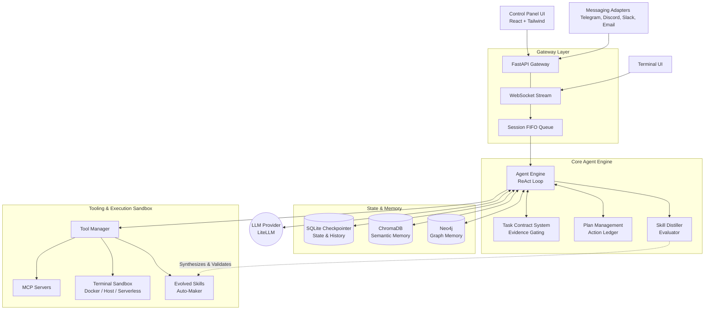

# Distill Architecture

Here is the high-level architecture diagram for the Distill framework. It visualizes the flow of data from external interfaces (UI, Adapters), through the asynchronous FastAPI gateway, and into the core ReAct Agent loop, which coordinates with memory stores, tooling, and execution sandboxes.

This document covers *what* the pieces are; the design rationale behind each decision lives in [docs/DESIGN.md](docs/DESIGN.md).

## Sub-Agent Delegation Model

Distill can fan a task out to specialist sub-agents through the built-in
`delegate_task` tool. This is **bounded, delegated execution** — each sub-agent
runs a single scoped task and returns its result to the parent, which folds the
results back into its own ReAct loop. It is **not** a persistent shared-state
swarm, and there is no per-agent channel routing or long-lived agent registry:
sub-agents have no shared mutable state, do not talk to each other, and cease to
exist once their task returns.

### Roles

`delegate_task` injects a role-specific directive (`_SUB_AGENT_DIRECTIVES` in
`src/agent.py`) into each spawned sub-agent:

| Role | Purpose |
|---|---|
| `researcher` | Gather and synthesise factual information; read-only, no side effects. |
| `coder` | Produce, modify, or refactor source code exactly as instructed. |
| `auditor` | Scan code for bugs and security weaknesses; report findings with severity. |
| `planner` | Decompose a goal into an ordered, verifiable JSON step list (plans only). |

### Bounds

Execution is governed by `SubAgentOrchestrator` (`src/agent.py`), which runs
delegated tasks under an `asyncio.Semaphore` with a per-task timeout. Limits are
configurable via environment variables:

| Limit | Default | Env var |
|---|---|---|
| Max tasks per batch | 8 | `AGENT_SUB_AGENT_MAX_BATCH` |
| Max concurrency | 4 | `AGENT_SUB_AGENT_MAX_CONCURRENCY` |
| Per-task timeout (s) | 300 | `AGENT_SUB_AGENT_TIMEOUT_SECONDS` |
| Max recursion depth | 2 | `AGENT_SUB_AGENT_MAX_DEPTH` |

A timed-out sub-agent returns a structured timeout result rather than crashing
the parent run, and depth limiting prevents unbounded recursive delegation.
